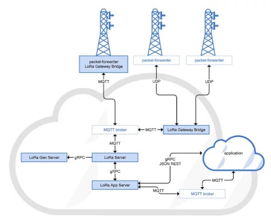
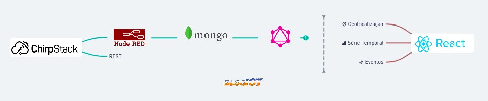
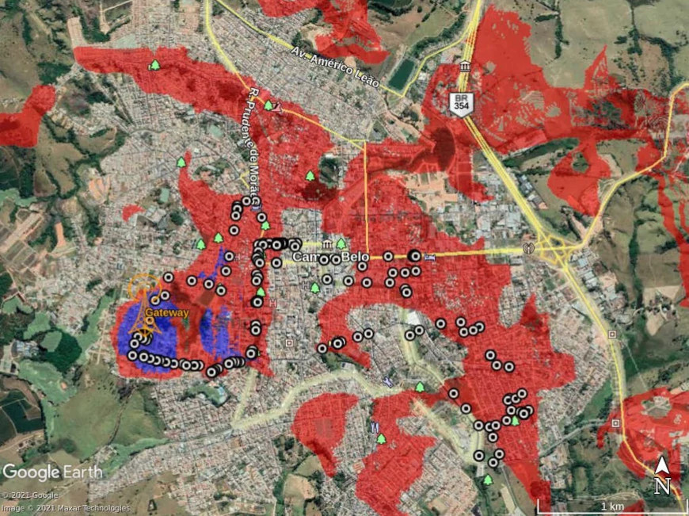

Podemos dizer que a programação FullStack começa depois que configuramos o
servidor LoRaWAN. Neste Post irei mostrar os caminhos que escolhi para ler os
dados do servidor, armazenar em banco de dados e criar uma sistema WEB que
utiliza esses dados. Os resultados estão sendo adquiridos para preencher o
conteúdo do BlogIoT e também como prova de conceito (PoC) da pilha LoRaWAN.
Desta vez utilizei equipamentos da RAKwireless.

O Gateway RAK7244P para desenvolvedores, Fig. 1 esquerda, é composto por: um
concentrador RAK2245 para comunicação LoRa, um Raspberry PI 4 de 2 GB de RAM e
um RAK9003 Pi HAT para energizar o equipamento por PoE. A integração do
Raspberry é devido a necessidade de instalar o servidor Chirpstack em um sistema
operacional Linux, neste caso o Raspbian Lite. Esta escolha não substitui
completamente o uso do gateway comercial, porém tenho todos os recurso de
aprendizagem. A direita é um dispositivos LoRa RAK7205, com algumas integrações
do tipo GPS, sensores de ambiente e acelerômetro.

Como já sabemos, trabalhar com o servidor ChirpStack é separar três estruturas
fundamentais: LoRa Gateway Bridge, LoRa Server, e LoRa App Server, Fig. 2. Cada
estrutura, tem a sua responsabilidade específica, e o resultado é algo do tipo
JSON REST ou gRPC. Segundo a natureza do sistemas IoT, o consumo, do payload,
por REST não é o mais recomendado e, para meu caso, gRPC ainda é um assunto
novo. Outra opção seria habilitar o uso do Broker MQTT através de integração com
o servidor LoRa App.

Conseguimos instalar o Servidor ChirpStack por linha de comandos. Para habilitar
o Broker MQTT é preciso entrar no arquivo de configuração do servidor e fazer as
alterações específicas, cada estrutura citada tem seu arquivo de configuração
.toml, onde conseguimos fazer não só a configuração das integrações do LoRa App
server, como a configuração do gateway para os padrões regionais LoraWAN,
certificado pela LoRa Alliance. O RAK7244 já vem com o Chirpstack instalado,
porém, no site da Chirpstack encontramos atualizações através do Gateway OS.

Após o Broker MQTT ter sido habilitado no servidor, podemos programar um cliente
MQTT em JavaScript, responsável por fazer a assinatura e publicação (Sub/Pub)
dos registros que chegam até o gateway. Com este mesmo serviço, conseguimos
salvar os dados no MongoDB Atlas utilizando mongoose.

Este momento já é um caso de evolução! Armazenar os dados em um banco de dados,
significa que consigo resgatá-los a qualquer momento. Também posso escolher qual
será o próximo passo, o que fazer com esses dados? Para o servidor funcionar,
meu computador pessoal não precisa estar ligado, e como os dados estão em nuvem,
consigo acessar de qualquer lugar. O próximo passo é montar uma Interface de
Programação de Aplicativos (API).

Minha escolha por Javascript foi devido a variedade de recursos que a ferramenta
consegue alcançar em desenvolvimento WEB e também, a quantidade de conteúdo
disponível no Youtube. A arquitetura de software que utilizei ficou representada
pela figura abaixo.

A forma como planejei, permite facilmente escolher outra linguagem de
programação, e/ou turbinar o código existente. Construí duas APIs, uma RESTFull,
muito fácil, utilizando Strapi, e outra mais completa, utilizando GraphQL. Digo
que são ótimas as experiências adquiridas com um protótipo de sistema WEB.
Dentre os aprendizados, posso citar: configurar acesso a API sobre token JWT,
variáveis de ambiente, CI/CD, CORS, criptografia e também pensar qual será o
produto mínimo viável (MVP). É 50% do tempo programando e os outros 50%
escrevendo a documentação.

No frontend a história é um pouco diferente. Sabemos que é nessa parte onde
conseguimos expressar melhor as nossas ideias... As cores, animações,
propagandas, fotos e organizações das telas. Para isso, procurei utilizar CSS
puro no início, migrando para CSS in JS posteriormente. As melhores artes de
frontend podem ser encontradas no canal Online Tutorial do Youtube. Este rapaz é
muito bom! Por trás disso, utilizei a biblioteca JavaScript React.

Agora sim tenho uma rede LoRaWAN funcionando e um sistema de armazenamento de
dados recebendo informações igual a uma torneira aberta. Estou pronto para fazer
os teste experimentais e uma análise dos dados no frontend. O Gateway RAK7244
não é resistente a chuva. Dessa maneira, instalei na varanda daqui de casa. Sua
antena é pequena, com ganho de 2dBi. Configurei o equipamento para transmitir em
sua potência máxima.

O sensor RAK7205 Track, Fig. 1 direita, é um dispositivo que utiliza uma antena
impressa com ganho de 0.24dBi, operando na faixa de frequência de 915MHz. Irei
levá-lo no drive test para registrar o RSSI. Esse é um sensor que contém as
seguintes funcionalidades de fábrica: módulo Ubox MAX 7Q GPS, BME680 para medir
a qualidade do ar, LIS3DH 3-axis MEMS acelerômetro, 69Board com 30 pinos e
suporte para bateria de lítio. Quando em modo sleep consome aproximadamente
14,6uA e é programado por Comando AT ou pelo compilador online da RAKwireless.

Foi realizado o drive test na cidade de Campo Belo - MG, e em alguns lugares uma
medição com o sensor parado, por alguns minutos. Dessa maneira consigo
contabilizar a quantidade de pacotes perdidos localmente. Configurei o sensor
para enviar informações a cada 26 segundos, transmitindo fixamente em SF12. A
cobertura estimada pelo Rádio Mobile, segue abaixo junto com os pingos de
comunicação.

Campo Belo é uma cidade que está a 945 metros de altitude e tem uma área de
526,75 Km2. Como mostra a figura 4, o relevo é composto por morros e vales. A
localização do gateway é considerado um lugar alto da cidade e por isso um campo
aberto para propagação da onda eletromagnética. Fazendo uma simulação no Radio
Mobile é possível implantar uma rede LoRaWAN com mais facilidade.

Dessa forma, não percebo nenhuma limitação em programar um sistema IoT com
JavaScript. Mesmo sendo Engenheiro de Telecomunicações, o interessante é
conhecer tanto as possibilidades, quanto as falhas que o sistema pode ter. Para
nós Programadores é ter uma base de dados, um destino planejado e um propósito
de vida. Tão certo que preciso dar manutenção no sistema, pois esperamos grande
volume de requisições e inteligência artificial (AI).

No final, pude comparar com resultados do primeiro post. Obtive melhores
medições na comunicação com o sensor, chegando a 2.5km de distância, e uma
sensibilidade de recepção máxima de -121dBm. A distância não seria o parâmetro
mais esperado, posto que próximo de minha casa o sinal poder ser fraco, porém, a
simulação do Radio Mobile nos auxilia sobre a dimensão da cobertura LoRa. Obtive
evolução, também, na forma em como foi feito o drive test. Dessa vez, eu saí da
cobertura e pude perceber quando voltei a ela, através dos pontos de comunicação
e do intervalo de tempo entre eles, apresentando valores direto na tela do meu
telefone celular.

Construí um Aplicativo Demo que pode ser acessado, após fazer um cadastro, aqui.
Aceito qualquer tipo de ideia ou crítica. Isso pode melhorar meu trabalho!

Para o próximo post irei me dedicar em programar novos dispositivos
associando-os a aplicação. Percebo que até agora fiz apenas o caminho de leitura
do sensor. Dessa forma, também pretendo fazer o caminho inverso, e assim, poder
atuar no dispositivo. Minha última observação é que vejo isso como um TestBed,
uma plataforma e ambiente de desenvolvimento de novos produtos de IoT. Até lá...
