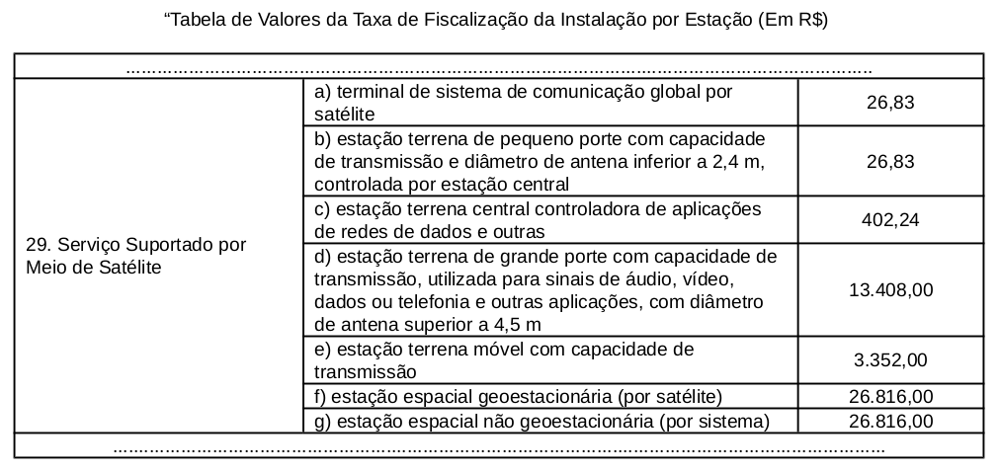
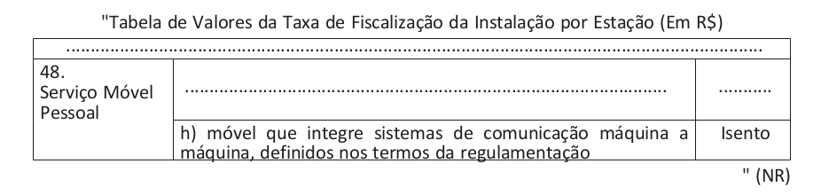

[radiação restrita]: https://www.blogiot.com.br/post/radiacao-restrita

> Neste post buscamos entender como as leis, aprovadas pelo governo, pode ajudar
> na ampliação da conectividade e inclusão digital. Se houver algum mal
> entendimento das leis, pedimos desculpas. Não somos um canal que passa
> confiança jurídica. Porém reforçamos que somos um espaço de aprendizagem das
> coisas e isso envolve um conhecimento multidisciplinar.

Se você trabalha com tecnologia, agronegócio, cidades inteligentes ou apenas
acompanha o mercado de internet, precisa conhecer a Lei nº 15.320/2025.
Recentemente sancionada, ela traz um fôlego extra para a transformação digital
no Brasil ao prorrogar benefícios tributários essenciais que venceriam em breve
e incluem dispositivos M2M (Machine-to-Machine).

Também podemos facilitar a forma de pensar e imaginar que com o passar dos
tempos novas tecnologias e novos dispositivos eletrônicos foram lançados e por
isso precisou atualizar alguns pontos da Lei.

Digamos que, em 2021, aprovaram a Lei 14.173, oferecendo uma redução de custos
regulatórios e incentivando a expansão de novas tecnologias. Como a internet por
satélite e o 5G. Até o momento, os equipamentos de transmissão com
radiofrequência, eram do tipo: transmissão de sinal de TV, rádios e telefones
2G/3G. O que percebemos é que a Lei tratou o diâmetro das antenas. Quando digo
antenas também entra comunicação com satélites e antenas de TV via satélite. E
assim delimitou antenas com diâmetro inferior a 2,4m e superior a 4,5m.
Reduzindo o custo consideravelmente para equipamentos pequenos e médios.

Adiantando um pouco o tempo, agora em 2025, encontramos a Lei 15.320 que
similarmente a anterior citada, adicionou equipamentos M2M - máquina a máquina.
Além de estender os prazos da lei 14.173. O foco dessas duas lei são as
tecnologias que conectam o mundo de forma invisível e eficiente:

Para entender a importância desse "abono", basta olhar a diferença de custos
estabelecida nas tabelas abaixo. Sem esse benefício, um terminal de pequeno
porte ou um sensor M2M poderia ser tributado como uma estação comum, custando
milhares de reais. Com a lei atual, os valores por unidade são mínimos: TFI
(Taxa de Fiscalização de Instalação): Apenas R$ 26,83 . Condecine (Contribuição
para Desenvolvimento da Indústria Cinematográfica Nacional): Apenas R$ 4,14 .
CFRP (Contribuição para Radiodifusão Pública): Apenas R$ 1,34 . Para efeito de
comparação, uma antena de grande porte (maior que 4,5m) paga R$ 13.408,00 de TFI
— um valor que inviabilizaria qualquer projeto de IoT em larga escala. Logo,
separando os custos, dessas taxas, por diâmetro da antena, nos possibilitou
maior acesso.

A lei 14.173/2021 deixa claro que o streaming não se inclui na categoria de
"outros mercados" para fins de pagamento da Condecine, independentemente da
tecnologia utilizada. Os recursos do Fust agora priorizam a conectividade de
escolas públicas, reforçando o papel social dessas desonerações.

É válido lembrar que dispositivos que operam via LoRa em frequências de radiação
restrita muitas vezes nem chegam a pagar essas taxas, pois são isentos de
licenciamento individual pela Anatel. A lei mencionada é crucial principalmente
para dispositivos que usam redes de operadoras (como NB-IoT, 5G) ou conexão via
satélite direta e cartões e-SIM.

Agora vamos parar de ficar explicando e vamos direto ao que mais importa, abaixo
os custos apresentados pelas leis. Apresentei apenas para TIF, para
entendimento.

Repare bem quando fala de estação terrena central controladora de aplicações de
rede de dados e outras. Isso significa gateway, estações de rádio 5G, etc. Ja as
estações terrenas móvel com capacidade de transmissão, o valor das taxas pode
chegar a 4 mil reais.

M2M ficou isento de todas as taxas, favorecendo a instalação de sensores.

Sistemas Máquina a Máquina (M2M): São os famosos dispositivos de Internet das
Coisas (IoT), como sensores de umidade no campo ou rastreadores de frotas.
Celular não entra como dispositivo M2M porque o conceito dessa tecnologia exige
a ausência total de intervenção humana direta na comunicação. O bluetooth apesar
de ser M2M, não garante benefícios fiscais pelo mesmo motivo da tecnologia LoRa,
eles operam em frequências livres [radiação restrita], não gerando cobrança de
taxas de licenciamento que precisem ser zeradas.

Estações Satelitais de Pequeno Porte: Inclui terminais de comunicação global por
satélite (como as utilizadas pela Starlink e antenas de TV) e antenas com
diâmetro inferior a 2,4 metros, incluindo antes terrestres para comunicação de
dados, 5G por exemplo.
